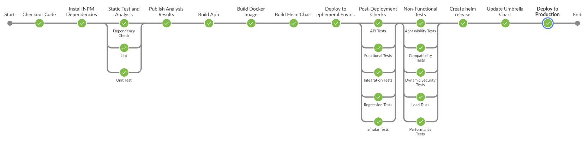

## Pipeline Overview

The CodeVeros Jenkins pipeline has a series of build, deploy, and test functions built into
it by default. The pipeline supports:

* Docker container images
* Helm charts for installation into a kubernetes cluster
* Static analysis using SonarQube
* Publishing to a Nexus artifact server
* Deployment of on-demand ephemeral test environments
* Functional testing levels: unit, API, and end-to-end UI tests
* Non-functional testing: security and performance tests

Figure: Jenkins pipeine steps

The main entrypoint for the pipeline depends on the type of service you are actually building:
* [Node Service Pipeline](./vars/runNodeSvcPipeline.groovy) - builds a deploys a NodeJS service
* TBD: Other services

There are some major steps that should be highlighted:

*Build* - compile your application (e.g., for JavaScript this would be assembling the NPM dependencies).
This is kicked off as part of your pipeline entrypoint.

*Static Analysis* - scan your code and dependencies using SonarQube and OWASP Dependency Check to
find bugs, defects, vulnerabilities, and other quality issues. 

  * [sonarQubeScan()](./vars/sonarQubeScan.groovy) - runs Sonar scanner
  * [dependencyCheck()](./vars/dependencyCheck.groovy) - runs OWASP Dependency Check

*Unit Test* - run unit tests on your code

After these steps are complete, then results are published to a SonarQube server. The next stage is to
package and publish your application such that it can be installed later.

*Build App* and *Build Docker Image* - assemble your application and create docker container with your
runnable code

*Build Helm Chart* - build and publish the Helm chart that can install your application

One it is published, the pipeline will deploy your application to an on-demand ephemeral environment
for localized testing.

*Deploy to Ephemeral Environment* - run the Helm deployment into a custom, unique kubernetes namespace to
launch the full application with all installed services.

*Post-Deployment Checks* - run various suites of API tests, Functional tests, Integration tests, Regression
tests, and Smoke tests against the ephemeral environment.

*Non-Functional Tests* - run Accessibility, Compatibility, Load, Performance, and Dynamic Security tests
against against the deployed ephemeral environment.